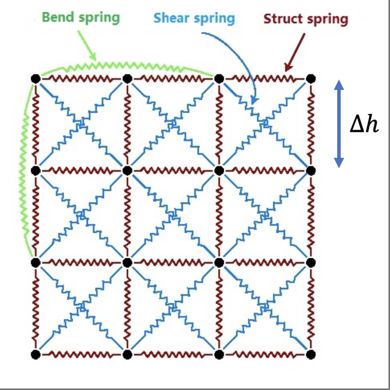
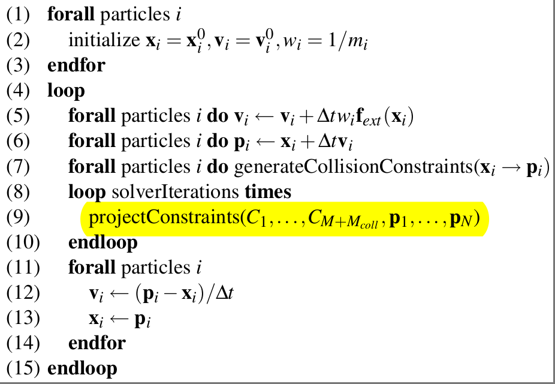
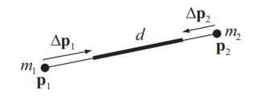

# 布料仿真
## 弹簧质点法：弹簧约束
### 基本结构

- structure：相邻质点，组成基本结构
- bending：隔一个质点，防止弯曲
- shearing：交叉质点，防止剪切

每一帧计算相邻质点间的弹簧力，然后计算速度和位置的变化

### 显式欧拉
根据弹簧力计算加速度，用旧值更新速度和位置

### 隐式欧拉
用新值更新速度和位置

$$
x_{t+1}=x_t+hf(x_{t+1})
$$

直接求解不太方便，可以进行一定形式的替换：

$$
x_{t+1}-x_t=hf(x_{t+1})
$$

$$
\downarrow
$$

$$
\Delta x=hf(x_t+\Delta x)
$$

用一阶泰勒来估计 $f(x_t+\Delta x)$ ：

$$
\Delta x=h(f(x_t)+f'(x_t)\Delta x+O(\Delta x^2))
$$

这里引入的二阶误差，相比显式欧拉造成的不稳定性，可以接受。

对于布料的弹簧质点模型，先求速度：

$$
v_{n+1}=v_n+\Delta t\frac{f_{n+1}}{m}
$$

隐式方法中 $f_{n+1}$ 是后一帧的弹簧力，但现在无法直接求。将弹簧力表示为关于位置 $x$ 和速度 $v$ 的函数 $f(x,v)$ ，求速度的偏导，然后将速度变化量用偏导表示出来：

$$
f'(x_a,v_a,x_b,v_b)=\frac{\partial f}{\partial x_a}\Delta x_a+\frac{\partial f}{\partial v_a}\Delta v_a+\frac{\partial f}{\partial x_b}\Delta x_b+\frac{\partial f}{\partial v_b}\Delta v_b
$$

$$
\begin{aligned}
\Delta v_a &=\frac{\Delta t}{m}f_{n+1} \\
&= \frac{\Delta t}{m}(f_n+\frac{\partial f}{\partial x_a}\Delta x_a+\frac{\partial f}{\partial v_a}\Delta v_a+\frac{\partial f}{\partial x_b}\Delta x_b+\frac{\partial f}{\partial v_b}\Delta v_b) \\
&= \frac{\Delta t}{m}(f_n+\frac{\partial f}{\partial x_a}v_{a,n+1}\Delta t+\frac{\partial f}{\partial v_a}\Delta v_a+\frac{\partial f}{\partial x_b}v_{b,n+1}\Delta t+\frac{\partial f}{\partial v_b}\Delta v_b) \\
&= \frac{\Delta t}{m}(f_n+\frac{\partial f}{\partial x_a}(v_a+\Delta v_a)\Delta t+\frac{\partial f}{\partial v_a}\Delta v_a+\frac{\partial f}{\partial x_b}(v_b+\Delta v_b)\Delta t+\frac{\partial f}{\partial v_b}\Delta v_b)
\end{aligned}
$$

接下来，除 $\Delta v_a$ 和 $\Delta v_b$ 外都是已知量，将含 $\Delta v_a$ 和 $\Delta v_b$ 的项分离开得到：

$$
(m-\Delta t\frac{\partial f}{\partial v_a}-{\Delta t}^2\frac{\partial f}{\partial x_a})\Delta v_a-(\Delta t\frac{\partial f}{\partial v_b}+{\Delta t}^2\frac{\partial f}{\partial x_b})\Delta v_b \\
=\Delta t(f_n+\Delta t(\frac{\partial f}{\partial x_a}v_a+\frac{\partial f}{\partial x_b}v_b)) \tag 1
$$

整理矩阵方程：

$$
Ax=b
$$

对于质点a，式(1)是只考虑一个相邻质点$b$的偏微分方程，实际上应有4个structure、4个bending、4个shearing质点。

需要求的是各个质点的速度变化量 $x=[\Delta v_1,\Delta v_2,...,\Delta v_n]^T$ ，等式左侧 $\Delta v_a$ 的系数整理到矩阵 $A$ 的 $(a,a)$ 处， $\Delta v_b$ 的系数整理到矩阵 $A$ 的 $(a,b)$ 处，等式右侧整理到 $b$ 中的 $(a)$ 处。另外11个相邻质点 $b_n$ 的 $\Delta v_a$ 系数和 $\Delta v_{b_n}$ 系数分别整理到 $(a,a)$ 和 $(a,b_n)$ 处，注意矩阵 $A$ 对角线 $(a,a)$ 处和 $b$ 在 $(a)$ 处的值需要累加，非对角线处的值不需要累加。

最后使用隐式欧拉方法更新：

$$
v_{n+1}=v_n+\Delta v \\
x_{n+1}=x_n+\Delta tv_{n+1}
$$

对于structure、bending、shearing三个应力，

$$
f_a=k(L-||p_a-p_b||)\hat p_{ab}
$$

$$
\frac{\partial f_a}{\partial p_a}=k(-\hat p_{ab}\hat p_{ab}^T+(L-||p_{a}-p_{b}||)\frac{I-\hat p_{ab}\hat p_{ab}^T}{||p_a-p_b||})=-\frac{\partial f_a}{\partial p_b}
$$

$$
\frac{\partial f_a}{\partial v_a}=\frac{\partial f_a}{\partial v_b}=0
$$

对于阻尼力，

$$
f_{da}=k_d((v_b-v_a)\cdot \hat p_{ab})\hat p_{ab}
$$

$$
\frac{\partial f_{da}}{\partial p_a}=k_d((v_b-v_a)\cdot \hat p_{ab})\frac{I-\hat p_{ab}\hat p_{ab}^T}{||p_a-p_b||}+k_d\frac{I-\hat p_{ab}\hat p_{ab}^T}{||p_a-p_b||}(v_b-v_a)\hat p_{ab}^T
=-\frac{\partial f_{da}}{\partial p_b}
$$

$$
\frac{\partial f_{da}}{\partial v_a}=-k_d\hat p_{ab}\hat p_{ab}^T=-\frac{\partial f_{da}}{\partial v_b}
$$

以上偏导的推导可参考：[Miles Macklin](https://blog.mmacklin.com/2012/05/04/implicitsprings/)

### 地面碰撞和摩擦
与地面（ $y=0$ ）的碰撞：根据配置的恢复系数，当布料质点位于 $y=0$ 平面下方时，将 $y$ 方向上的速度反向并乘以恢复系数 $r$ ，这种简单的方式即可模拟比较理想的碰撞和反弹效果。为保持稳定的接触条件，重置地面下方的质点位置时设置为 $y=-\epsilon$ ， $\epsilon$ 是一个误差允许值比如 $1e-6$ 

与地面的摩擦：当布料质点和地面的碰撞发生时，根据速度变化求出质点受到的冲量，进而求出质点所受的正压力，乘以 $\mu$ 即为所受的摩擦力。令 $v_y=v \cdot e_y$ ， $v_{xz}=v \cdot (e_x + e_z)$ ，摩擦力 $f_f$ 的大小为：

$$
||f_f||=\mu((1+r)\frac{m|v_y|}{\Delta t}+mg)
$$

方向为：

$$
\hat f_f=\frac{v_{xz}}{|v_{xz}|}
$$

在隐式欧拉方法中，摩擦力关于速度的偏导为：

$$
\frac{\partial f_f}{\partial v}=\frac{\partial ||f_f||}{\partial v}\hat f_f^T+||f_f||\frac{\partial \hat f_f}{\partial v}
$$

其中

$$
\frac{\partial ||f_f||}{\partial v}=[0,-\mu(1+r)\frac{m}{\Delta t},0]^T
$$

$$
\frac{\partial \hat f_f}{\partial v}=\frac{I-\hat f_f \hat f_f^T}{||v_{xz}||}
$$

对于其他的静态碰撞和摩擦，可以使用类似的方式来推导。

## 基于PBD的布料

### 算法流程

$C_{M+M_{coll}}$ ：$M$个固定约束（比如布料质点之间的相互约束）、 $M_{coll}$ 个碰撞约束（比如布料质点和外部模型的碰撞）

先根据外力更新速度和位置（预测的速度和位置），然后对位置进行约束，用约束后的位置更新速度。

这种方式是无条件稳定的，唯一影响稳定性的因素是对位置进行约束时的求解方式。

### 位置约束投影

很多约束都是非线性的，文章借助Gauss-Seidel的思想：逐个独立地求解每个约束，多次迭代得到最终结果，参考[MathUtils.md](./MathUtils.md)

对于质点布料：

$$
\Delta p_1=-\frac{w_1}{w_1+w_2}(|p_1-p_2|-d)\frac{p_1-p_2}{|p1-p_2|}
$$

$$
\Delta p_2=\frac{w_1}{w_1+w_2}(|p_1-p_2|-d)\frac{p_1-p_2}{|p1-p_2|}
$$

每一帧中按照固定顺序，逐个求解每个约束，向梯度方向上更新位置，多次迭代后得到收敛结果。

### 碰撞和摩擦
  
支持连续性碰撞检测，对于每个质点的上一帧位置 $x_i$ 和用外力预测出的位置 $p_i$ ，打一条射线 $x_i\rightarrow p_i$ ，如果击中了另一个物体表面，计算击中点 $q_c$ 和法矢量 $n_c$ ，增加约束 $C(p)=(p-q_c)\cdot n_c\ge 0$ ；若射线 $x_i\rightarrow p_i$ 完全在另一个物体内部，直接用静态碰撞检测方式：找最近的表面点 $q_s$ 和法矢量 $n_s$ ，也增加约束 $C(p)=(p-q_s)\cdot n_s$

摩擦和恢复系数：在算法第16行直接进行处理，比如减速和反向。

两个动态物体的碰撞：放在一套求解器中求解，只不过两个物体的质点之间没有相互约束，但可能会有碰撞约束。

### 布料自碰撞
  
论文使用空间哈希来查找三角面片，对于穿过三角面片 $p_1,p_2,p_3$ 的质点 $q$ ，增加以下约束：

$$
C(q,p_1,p_2,p_3)=(q-p_1)\\frac{(p_2-p_1)\times(p_3-p_1)}{|(p_2-p_1)\times(p_3-p_1)|}-h
$$

其中 $h$ 是布料厚度，如果是从反面穿过的，就需要加个负号。

### 封闭气球

论文还提到了封闭气球里的压强约束表示：

$$
C(p_1,...p_N)=(\sum_{i=1}^{n_{triangles}}(p_{t_1^i}\times p_{t_2^i})\cdot p_{t_3^i})-k_{pressure}V_0
$$

梯度：

$$
\Delta_{p_i}C=\sum_{j:t_1^j}(p_{t_2^j}\times p_{t_3^j})+\sum_{j:t_2^j}(p_{t_3^j}\times p_{t_1^j})+\sum_{j:t_3^j}(p_{t_1^j}\times p_{t_2^j})
$$
