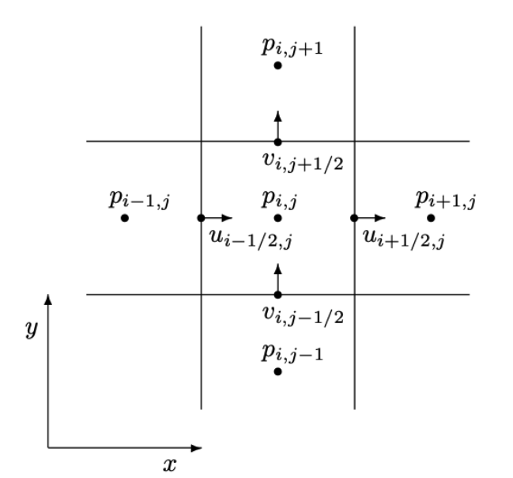

# 流体仿真
参考：Robert Bridson Fluid Simulation for Computer Graphics

## Navier-Stokes方程
流体粒子同样满足牛顿第二定律：
$$
m\frac{Du}{Dt}=F
$$
这里的微分算子用大写$D$表示，表示物质导数（material derivative），描述属性随流体场的变化规律。

考虑流体粒子所受的力，除了重力 $mg$ 外，还有附近粒子的相互作用。相互作用包括：由于压强差导致的推力、由于黏滞力导致的摩擦力（不太正确但直观的描述）。

压强差导致的推力，可以简单地使用压强的梯度来描述： $-V\nabla p$ ， $V$ 是粒子的体积， $p$ 是压强。

黏滞力导致的摩擦力，可以用速度的拉普拉斯算子来表示： $V\eta \nabla^2u$ ， $\eta$ 是黏滞系数，黏滞力可以让流体粒子倾向于和附近的粒子按照平均速度运动。

综合以上几个力：
$$
m\frac{Du}{Dt}=mg-V\nabla p+V\eta\nabla^2u
$$
除以体积 $V$ 得到：
$$
\frac{Du}{Dt}=g-\frac{1}{\rho}\nabla p+\frac{\eta}{\rho}\nabla^2u
$$
这就是navier-stokes方程的动量部分。

## 两种视角
一般有两种方法来表示流体：网格法（欧拉视角）和粒子法（拉格朗日视角），前者将流体的物理属性绑定在空间位置相对固定的网格内，优点是邻域关系明确，空间位置相对固定；后者将流体的物理属性放在一个个运动的有体积粒子上，优点是节约空间，可模拟范围较大。

## 网格法

### advection
可以这样直观理解：虽然欧拉视角中的网格是固定的，但流体在流动，先不考虑外力和压缩，对于某一个网格点 $x_i$ 而言， $t+\Delta t$ 时刻该处的流体组成已经发生了改变，其实是 $t$ 时刻位于 $x_i-\bar u\Delta t$ 处的流体流到了这里。因此， $t+\Delta t$ 时刻位于 $x_i$ 处的物理属性应与 $t$ 时刻 $x_i-\bar u\Delta t$ 处的物理属性对应。这里的物理属性也包括速度本身，advection反映的是物理属性随速度场的流动情况。这种用 $x_i-\bar u\Delta t$ 处的物理属性来修正$x_i$处物理属性的方法被成为semi-lagranrian（具有某种粒子特征）。这种方法可以推导出 $\frac{\partial u}{\partial t}$ 到 $\frac{Du}{Dt}$ 的转换，也是物质导数这一概念的来源。

### 不可压缩性：incompressibility
流体的不可压缩性表现在：与气体相比，流体发生体积改变的程度很小，在模拟中可以忽略不计。这个属性可以用散度算子表示，即对于任意一点来说，该处物理量聚集或发散的程度为0：
$$
\nabla \cdot u=0
$$
这就是navier-stokes方程的体积约束部分，或称为divergence-free。

### 程序实现
整理前面的内容，在不考虑黏滞性的情况下，navier-stokes方程的形式为：
$$
\begin{aligned}
\frac{Du}{Dt}&=g-\frac{1}{\rho}\nabla p \\ 
\nabla \cdot u&=0 
\tag 1
\end{aligned}
$$

接下来有一个小trick，使用分步（splitting）方法来更新速度变化。若 $q$ 关于 $t$ 的导数为：
$$
\frac{dq}{dt}=f(q)+g(q)
$$
则按照以下方式更新 $q$ ：
$$
\tilde q=q^{(n)}+\Delta tf(q^{(n)}) \\ q^{(n+1)}=\tilde q+\Delta t g(\tilde q)
$$
简单展开推导一下就可以发现，这种分步更新方式并不破坏欧拉方法的规则，仍然为 $O(\Delta t^2)$ 的截断误差。

按照上面的分步方法来更新 $u$ ：观察方程组(1)，可以拆解为3个部分：
$$
\frac{\partial u}{\partial t}=f_1+f_2+f_3
$$
- $f_1$ ：advection： $u_A=\text{advect}(u^{(n)},\Delta t,u^{(n)})$， $\text{advect}(u,\Delta t,\cdot)$ 表示前面提到的advection约束；
- $f_2$ ：外力（以重力为例）： $u_B=u_A+\Delta tg$ ；
- $f_3$ ：压强/不可压缩性： $u^{(n+1)}=u_B-\frac{\Delta t}{\rho}\nabla p$ ， $\nabla p$ 是满足不可压缩约束（ $\nabla \cdot u=0$ ）条件的压强梯度。

所采用的grid结构如下：

### $f_1$：advection

这一步需要用
$$
x'=x_i-\bar u\Delta t \tag 2
$$
处的速度 $u(x')$ 来校正 $x_i$ 处的速度。位置 $x'$ 不会完美落在网格点上，但可以找到该位置所在的正方形格子，然后用四个格点的速度来求插值。

对于式(2)中的速度 $\bar u$ ，可以直接采用位置 $x_i$ 处的速度 $u(x_i)$ 来估计（显式欧拉），也可用中点或RK等方法来提高精度，比如中点法：
$$
\begin{aligned}
x_{mid}&=x_i-\frac{1}{2}\Delta t u(x_i) \\
x'&=x_i-\Delta t u(x_{mid})
\end{aligned}
$$

### $f_2$：外力
对于重力，直接按照 $u_B=u_A+\Delta tg$ 计算即可，如果有其他保守力比如风力，也可按照常规的显式积分方法来求。

### $f_3$：压强/不可压缩性
将不可压缩约束展开：
$$
\begin{aligned}
\nabla \cdot u^{(n+1)} &=\frac{\partial u^{(n+1)}}{\partial x}+\frac{\partial u^{(n+1)}}{\partial y} \\
&\approx \frac{u^{(n+1)}_{i+\frac{1}{2},j}-u^{(n+1)}_{i-\frac{1}{2},j}}{\Delta x}+\frac{u^{(n+1)}_{i,j+\frac{1}{2}}-u^{(n+1)}_{i,j-\frac{1}{2}}}{\Delta y} \\
&(\Delta x=\Delta y) \\
&=\frac{1}{\Delta x}(u^{(n+1)}_{i+\frac{1}{2},j}-u^{(n+1)}_{i-\frac{1}{2},j}+u^{(n+1)}_{i,j+\frac{1}{2}}-u^{(n+1)}_{i,j-\frac{1}{2}})
\end{aligned}
$$
将下面的迭代公式代入上式：
$$
u^{(n+1)}=u^{(n)}-\frac{\Delta t}{\rho}\nabla p^{(n+1)} \tag 3
$$
其中 $\nabla p^{(n+1)}=\frac{p^{(n+1)}_{i+1,j}-p^{(n+1)}_{i,j}}{\Delta x}$ （以 $u^{(n+1)}_{i+\frac{1}{2},j}$ 为例），得到：
$$
\begin{aligned}
\nabla \cdot u^{(n+1)}&=\frac{1}{\Delta x}[&(u^{(n)}_{i+\frac{1}{2},j}-\frac{\Delta t}{\rho}\frac{p^{(n+1)}_{i+1,j}-p^{(n+1)}_{i,j}}{\Delta x}) \\
& &-(u^{(n)}_{i-\frac{1}{2},j}-\frac{\Delta t}{\rho}\frac{p^{(n+1)}_{i,j}-p^{(n+1)}_{i-1,j}}{\Delta x}) \\
& &+(u^{(n)}_{i,j+\frac{1}{2}}-\frac{\Delta t}{\rho}\frac{p^{(n+1)}_{i,j+1}-p^{(n+1)}_{i,j}}{\Delta x}) \\
& &-(u^{(n)}_{i,j-\frac{1}{2}}-\frac{\Delta t}{\rho}\frac{p^{(n+1)}_{i,j}-p^{(n+1)}_{i,j-1}}{\Delta x})] \\
&=0
\end{aligned}
$$
MAC网格将速度放在交界边上的方法恰巧可以使得压强的梯度可以获得二阶精度。化简得到：
$$
4p^{(n+1)}_{i,j}-p^{(n+1)}_{i+1,j}-p^{(n+1)}_{i,j+1}-p^{(n+1)}_{i-1,j}-p^{(n+1)}_{i,j-1}=-\frac{\rho \Delta x}{\Delta t}(u^{(n)}_{i+\frac{1}{2},j}-u^{(n)}_{i-\frac{1}{2},j}+u^{(n)}_{i,j+\frac{1}{2}}-u^{(n)}_{i,j-\frac{1}{2}})
$$
与布料隐式欧拉中使用稀疏矩阵直接求解$Ax=b$不同，这里采用Gauss-Seidel迭代来求解（参考[MathUtils.md](./MathUtils.md)），迭代公式为：
$$
\begin{aligned}
p_{i,j}&=\frac{1}{4}(p_{i+1,j}+p_{i,j+1}+p_{i-1,j}+p_{i,j-1}-\frac{\rho \Delta x}{\Delta t}(u_{i+\frac{1}{2},j}-u_{i-\frac{1}{2},j}+u_{i,j+\frac{1}{2}}-u_{i,j-\frac{1}{2}})) \\
&=\frac{1}{4}(p_{i+1,j}+p_{i,j+1}+p_{i-1,j}+p_{i,j-1}-\frac{\rho \Delta x^2}{\Delta t}(\nabla \cdot u))
\end{aligned}
$$
Gauss-Seidel迭代的停止条件为：迭代过程中的均方误差小于阈值，均方误差的计算方式为：
$$
L=\frac{1}{N_{grid}}\sqrt{\sum_{i,j}(p_{i,j}-\frac{1}{4}(p_{i+1,j}+p_{i,j+1}+p_{i-1,j}+p_{i,j-1}-\frac{\rho \Delta x^2}{\Delta t}(\nabla \cdot u)))^2}
$$

求出 $p^{(n+1)}$ 之后，再求出 $\nabla p^{(n+1)}$ ，最后使用式(3)来更新 $u^{(n+1)}$ .  $u^{(n)}_{i+\frac{1}{2},j}$ 、 $u^{(n)}_{i-\frac{1}{2},j}$ 、 $u^{(n)}_{i,j+\frac{1}{2}}$ 、 $u^{(n)}_{i,j+\frac{1}{2}}$ 即前一步得到的 $u_B$ .

### 边界问题和障碍物
模拟场景里存在两种边界，一个是空边界，即流体可以自由出入（一般只有出），但边界外不在模拟区域内；另一种是障碍边界，即流体会被阻挡，无法自由出入，一般是模拟区域内的实体（刚体）。前者称作“Dirichlet边界”，后者称作“Neumann边界”。

- Dirichlet边界：对格点置零即可，对于物理量随速度场的流动没有阻碍作用。
- Neumann边界：与相邻的边界相等。固体障碍物边界上的法向速度为0，因此固体表面的压强与界面上的流体压强保持一致。有一个tricky的点：此处记录的压强并不是固体内的压强，而是固体表面的压强，因为Neumann边界考量的是某个方向上的梯度，这意味着当一个格点是固体时，需要记录多个可能与流体接触的方向上的压强。

另外还有一点，对于advection的边界问题，当假想的上一帧粒子出现在边界外（包括空边界和障碍边界）时，直接投影到距离边界最近的格点或边界处进行计算。

如需模拟水体，需要使用特殊方法，至少需要维护水体的边界随速度场的变化，可通过水平集实现

## 粒子法

TODO

