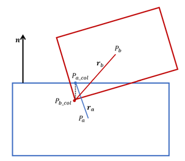
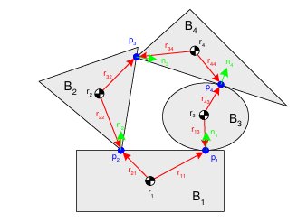
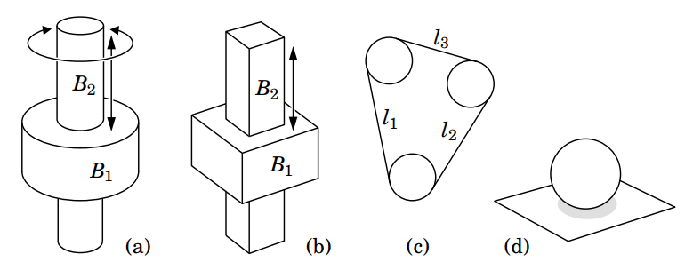
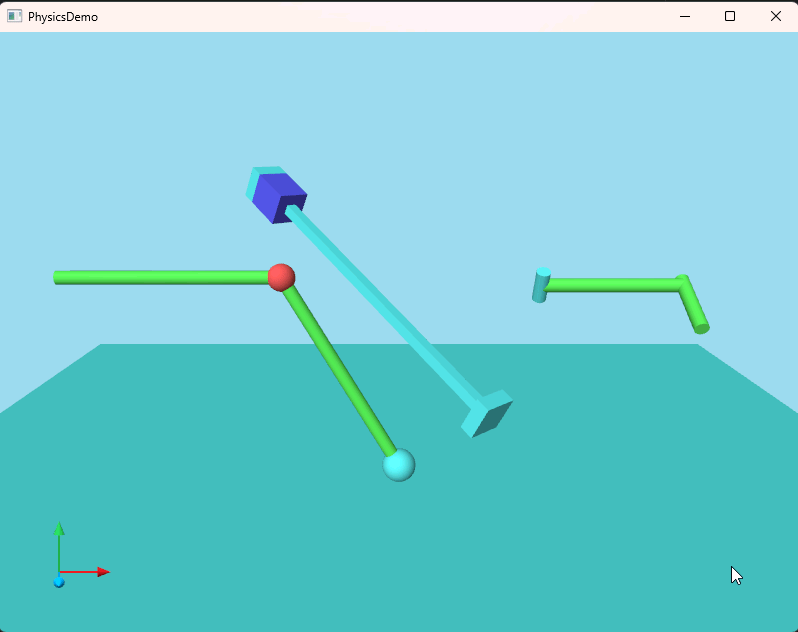
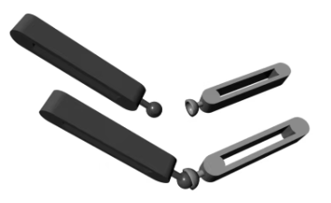
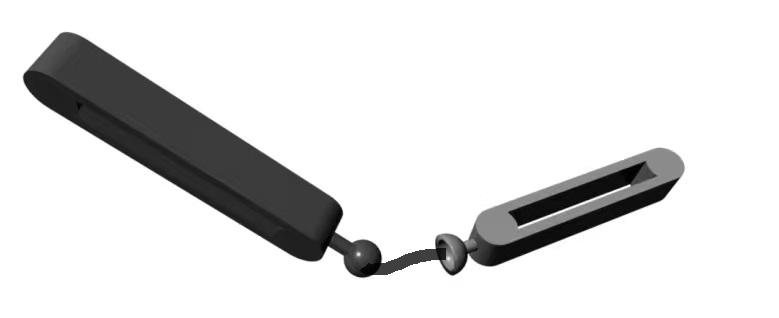
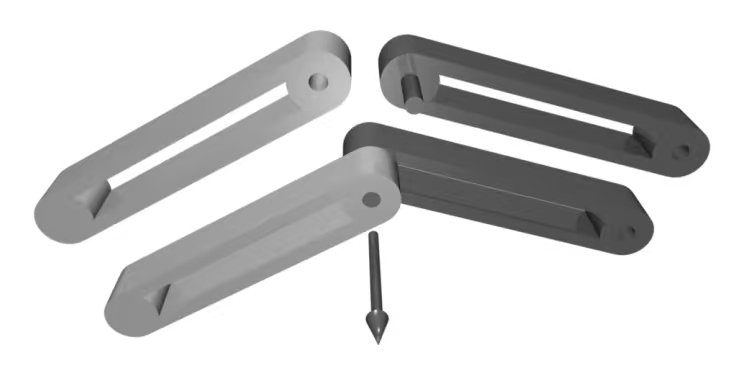
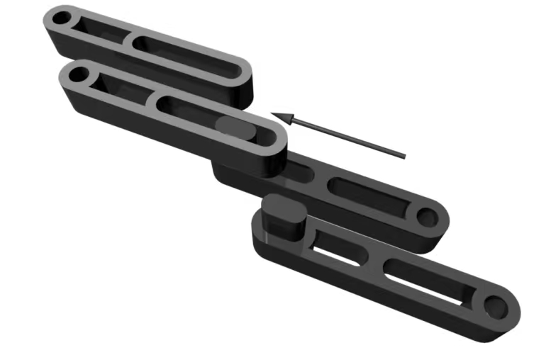

# 刚体仿真（面向游戏引擎）

这篇刚体笔记的求解部分与2005年的书籍Stable, Robust, and Versatile Multibody Dynamics Animation方法一致，这是很多游戏物理引擎的基础，在实时性和稳定性上有很好的取舍。

## 刚体物理基础

### 物理属性

刚体的基本物理属性包括：惯性属性、位置和朝向、速度和加速度等。与普通粒子或质点不同，刚体有体积和朝向，除了3个位置自由度外还有3个旋转自由度。对于粒子和质点而言，惯性属性只有质量，而对于刚体，还有一个属性：惯性张量，这是转动惯量在三维空间中的描述，通常用矩阵$I\in R^{3\times 3}$表示，但由于一般刚体的形状大多是对称的，只有对角线非零，所以也有物理引擎简化为直接用一个三维矢量来储存。

- 惯性张量的物理意义：对于任意方向$n$，$In$表示刚体绕轴$n$的转动惯量；刚体的角速度为$\omega$，则刚体的角动量为$I\omega$，角动能为$\frac{1}{2}\omega^TI\omega$，牛顿第二定律的力矩形式（欧拉方程）：$T=I\dot \omega + \omega \times I\omega$，后面的$\omega \times I\omega$是描述陀螺效应（进动）的项。

- 对于某些求解器，会把质量和惯性张量一并考虑：$\hat I\in R^{6\times 6}$，$\hat I=\left[\begin{matrix}
M & 0\\
0 & I
\end{matrix}\right]$，其中$M=mI_3$，\hat I也可看做广义质量矩阵；甚至在一些高精度求解器中，会进一步将所有刚体的质量属性存成一个大型的稀疏矩阵（游戏级别的物理引擎一般用不到）。

惯性张量矩阵和质量一样，属于已知常量，通常在刚体初始化时就定好了。一般形状的惯性张量矩阵要通过积分来求，而一些常见的对称形状（质量为1、相对于质心）的惯性张量矩阵如下：

- 立方体：长宽高分别为abc，$I=\left[\begin{matrix}
  \frac{b^2+c^2}{12} & 0 & 0\\
  0 & \frac{a^2+c^2}{12} & 0\\
  0 & 0 & \frac{a^2+b^2}{12}
\end{matrix}\right]$

- 圆柱体：半径r高h，$I=\left[\begin{matrix}
  \frac{3r^2+h^2}{12} & 0 & 0\\
  0 & \frac{r^2}{2} & 0\\
  0 & 0 & \frac{3r^2+h^2}{12}
\end{matrix}\right]$

- 椭球体：轴向半径分别为abc，$I=\left[\begin{matrix}
  \frac{1}{5}(b^2+c^2) & 0 & 0\\
  0 & \frac{1}{5}(a^2+c^2) & 0\\
  0 & 0 & \frac{1}{5}(a^2+b^2)
\end{matrix}\right]$

- 胶囊体的精确惯性张量矩阵相对比较复杂，需要分成上下两个半球体和中间的圆柱体，通过组合公式（平行轴定理）计算得到，一般物理引擎则会直接通过胶囊体的包围盒来计算。

- 一般凸多面体：通常也直接用AABB或OBB来算，精确计算方法可参考：[PolyhedralMassProperties.pdf](https://www.geometrictools.com/Documentation/PolyhedralMassProperties.pdf)

- 复合刚体：指一个刚体具有多个sub shape，需要通过组合公式计算整体的惯性张量矩阵。注意不论是单刚体还是复合刚体，所储存的local inertia需要都相对于质心。

### 坐标系统

一般物理引擎的坐标和游戏引擎一样，用Transform来计算。Transform有两部分：Basis和Origin，分别表示旋转量和位移量。Origin是一个三维矢量，Basis可以是一个3x3的旋转矩阵，也可以是四元数，具体看引擎的实际选择，两种各有优劣，直接用旋转矩阵更直观一些，但可能需要正交化修正，所以可以在integrate步骤中用四元数来更新旋转，其他时候用旋转矩阵来做，比如向量变换和矩阵变换等。

记$R$为Transform.Basis，$T$为Transform.Origin，则对任意点$P$的变换为：$p'=Rp+T$，对任意矢量$v$的变换为$v'=Rv$，父节点的Transform为$(R_0,T_0)$，子节点的Transform为$(R_1,T_1)$，则经过级联后的子节点Transform为$(R_0R_1,R_0T_1+T_0)$

对于前面相对于质心的local inertia，通过计算可以变换为world inertia：$I_{world}=RI_{local}R^T$，$I_{world}^{-1}=(RI_{local}R^T)^{-1}=RI_{local}^{-1}R^T$，可以事先计算好local inertia的逆$I_{local}^{-1}$来避免重复计算。一些其他矩阵量的计算也是类似的。

很多教程中会出现一种特殊的符号标记$r^\times$：
$$r^\times = \left[\begin{matrix}
  0 & -r_x & r_y\\
  r_x & 0 & -r_z\\
  -r_y & r_z & 0
\end{matrix}\right]$$
这是一个由矢量得到的反对称矩阵，与叉积关系紧密：$a\times b=a^\times b$，在许多计算中会很有用处。

由于储存性能，额外引入的误差等原因，游戏物理引擎中也一般不会用到齐次坐标。

### 一些数学概念

- 雅可比（Jocabian）矩阵$J$：约束的一阶导矩阵。矢量$x\in R^n$的约束$C$表示为：$f(x)=(\le,\ge) 0$，存在若干个这样的约束$C_1,C_2,...C_m$，则雅可比矩阵J\in R^{m\times n}$：
  $$J=\left[\begin{matrix}
  \frac{\partial f_1}{\partial x_1} & \frac{\partial f_1}{\partial x_2} & ... & \frac{\partial f_1}{\partial x_n} \\
  \frac{\partial f_2}{\partial x_1} & \frac{\partial f_2}{\partial x_2} & ... & \frac{\partial f_2}{\partial x_n} \\
  \vdots & \vdots & \ddots & \vdots \\
  \frac{\partial f_m}{\partial x_1} & \frac{\partial f_m}{\partial x_2} & ... & \frac{\partial f_m}{\partial x_n}
  \end{matrix}\right]$$
  类似的还有海森（Hessian）矩阵：约束的二阶导矩阵，但与雅可比矩阵不同的是，每个约束都有一个自己的海森矩阵：
  $$H_i=\left[\begin{matrix}
  \frac{\partial^2 f_i}{{\partial x_1}^2} & \frac{\partial^2 f_i}{\partial x_1\partial x_2} & ... & \frac{\partial^2 f_i}{\partial x_1\partial x_n} \\
  \frac{\partial^2 f_i}{\partial x_1\partial x_2} & \frac{\partial^2 f_i}{{\partial x_2}^2} & ... & \frac{\partial^2 f_i}{\partial x_2\partial x_n} \\
  \vdots & \vdots & \ddots & \vdots \\
  \frac{\partial^2 f_i}{\partial x_1\partial x_n} & \frac{\partial^2 f_i}{\partial x_2\partial x_n} & ... & \frac{\partial^2 f_i}{{\partial x_n}^2}
  \end{matrix}\right]$$
  雅可比矩阵描述了各个位置的约束梯度，在约束求解中经常会用，海森矩阵则描述的是各个位置当前约束的曲率，用于寻找极值点，或提取特征。
- 雅可比迭代、Gauss-Seidel迭代、PGS：参考[Constrint.md](Constraint.md)

### 积分方法

包括欧拉、中点法、Runge-Kuta、Verlet积分等，参考[ODE.md](ODE.md). 游戏引擎一般用半隐式欧拉即可，不需要更高的精度。

### 动力学过程

查阅资料发现，不同的刚体物理教程对动力学过程有不同的表现形式，最简单直接的为：
$$M\ddot x=f$$
即牛顿第二定律，对于刚体系统而言，这里的$f$和$M$分别为广义力（也有教程用$\tau$表示）和广义质量矩阵（即前面提到的$\hat I$）。某些地方还会考虑非惯性系的情况，比如旋转的球体表面、旋转的机械臂抓取物体的过程，会引入一个额外项$C(x,\dot x)$来表示科里奥利力和向心力：
$$M\ddot x+C(x,\dot x)=f$$
对于只有保守力场（比如重力场）的惯性系而言可以不用考虑。

前面的积分方法是从运动学视角来看，而动力学过程则是动力学视角，二者一般是需要综合起来看的，动力学过程中的力$f$为积分中的加速度$\ddot x = a(t)$提供了来源。

对于弹簧质点模型等简单的线性平滑模型而言，结合积分方法和动力学过程的仿真算法直观且简单，且不论是使用矩阵计算还是线性迭代，都具有良好的可控性和优化空间。然而，刚体的各类约束显然不属于这种类型，所以产生了各类有不同取舍的方法。

## 基本碰撞求解

### 整体计算流程

从一个简单的例子来看：给定两个刚体，蓝色为刚体A，红色为刚体B，某一时刻发生重叠：

刚体物理引擎大体上按照两个模块进行仿真求解：Collision Detection和Simulation.

- CollisionDetection：碰撞检测阶段包括
  - BroadPhase使用一些空间加速方案粗略查询有哪些可能发生相互重叠的碰撞对；
  - NarrowPhase求出刚体对的接触信息：接触点位置、接触点法矢量、侵入距离（Penetration），一般会选择其中一个刚体作为参考，比如图中用刚体A表面的作为接触点，用刚体A表面的法矢量作为接触法矢量，侵入距离为图中虚线长度。
  
  CollisionDetection目前的算法比较固定，BroadPhase不同引擎会有不同的空间加速方案比如HashGrid或动态AABB树等，但NarrowPhase基本就是SAT或GJK+EPA，也会有一些优化方案比如复用前一帧的分离轴。当侵入距离过大时，可能会发生穿透，这在时间步长较长，两帧之间刚体移动距离较大的情况下时有发生，因此产生了CCD碰撞检测（连续性碰撞检测），通过substep、射线扫描等方式防止穿透发生。

- Simulation：基于CollisionDetection阶段得到的碰撞信息，对刚体的运动进行约束，使之满足基本碰撞约束条件。根据不同需求和场景，会有很多不同的求解器实现方法：
  - 形式上包括基于约束的、基于冲量的、基于Penalty的，基于优化方法的等等；这里基于约束的约束和后面的各类约束不完全是一个意思。
  - 具体实现上有基于位置的、基于速度的、或基于力的约束等。

  基于优化方法的一般是高数值精度方案，如IPC，ABD等，后者甚至会考虑仿射形变，将完全刚性的要求放松为可发生仿射形变（如立方体-->平行四面体）并据此设计约束方案，这些方法具有很高的数值精度和稳定性，但性能开销大。

### 碰撞约束求解

下图中有4个刚体，共4x6=24个位置自由度，即有24个未知量需要求解，由于碰撞约束的亏秩性，把位置作为未知量来看是没有唯一精确解的，但可以求向着满足约束方向演化的未知量变化量，也就是速度，所以大多求解器是对速度进行求解，对于基本碰撞约束而言也是如此。对速度进行约束，是通过向刚体施加冲量来实现的，然后通过误差修正项从约束被破坏的状态中恢复。

碰撞约束的非线性因素主要体现在LCP问题（Linear Complementary Problem）和库伦摩擦上。LCP描述的是刚体的某些运动特征和约束有互补关系，比如当刚体之间有接触时，法向排斥不为0，没有接触时，法向排斥为0，这种关系用数学形式表示为：$z\ge 0; w\ge 0; z^Tw=0$；库伦摩擦则是几乎所有物理引擎会用到的描述摩擦约束的模型，要满足$|f_t|\le \mu f_n$，摩擦数值的变化在切向上呈现一个“Z”字形。

对于这种非线性因素，各种求解器有各种不同的处理方式，笔者也不尽了解。对于碰撞约束而言，碰撞检测阶段筛选出了发生相互侵入的刚体，这一步已经体现了LCP问题的一半，另一半通过约束速度来实现即可。通常在游戏引擎内会偏向性能侧的考虑，会尽量降低整体约束计算的复杂性，常用方式是通过逐个求解每个约束，然后多次迭代使得整体趋于收敛，类似Projected Gauss-Seidel迭代，这种方式也是PBD的实现基础。

回到前面那张两个刚体简单接触的图，接下来用直观的形式详细推导一下碰撞约束求解的过程：

**1. 约束公式推导**

如前所属，考虑对速度进行约束，约束条件为两个刚体在相互接触的法向上不能发生相互侵入，即法向上的相对速度要在分离方向上大于等于0：

$$n\cdot(v_b+\omega_b\times r_b-v_a-\omega_a\times r_a)\ge 0$$

令$J_{ab}=\left[\begin{matrix}
-n \\
-r_a\times n \\
n \\
r_b\times n
\end{matrix}\right]^T$，$u=\left[\begin{matrix}
v_a \\
\omega_a \\
v_b \\
\omega_b
\end{matrix}\right]$，（广义速度），则可以得到：$J_{ab} u\ge 0$，这里对LCP问题的处理方式是，当碰撞检测的结果里出现了这对刚体，说明这对刚体有相互碰撞，$J_{ab} u < 0$，通过正的$\Delta u$（指$\Delta u \cdot n>0$）将其约束到$J_{ab}(u+\Delta u)= 0$的分离状态即可；碰撞检测后没有这对刚体，说明没有发生碰撞，$J_{ab} u \ge 0$，那么$\Delta u$就为0.

不难发现，这里的$J_{ab}$正是描述整个刚体约束系统的雅可比矩阵的关于a和b碰撞的这一行（该行的其他维度都补充为0）。可以再次看出，雅可比矩阵是从位置约束本身出发，速度作为位置的一阶导，用于求解约束是常见且合理的。

**2. 约束求解过程**

现在有一个简化技巧：将$\Delta u$的方向固定在梯度方向上，这里的梯度方向就是$J_{ab}$所描述的方向。这在约束求解中是很常见的做法，因为梯度方向变化率最大，如果用数学原理描述就是拉格朗日乘子。另外，如果直接求解$\Delta u$相当于默认两个刚体的速度变化量相同，这明显不对，相同的应该是相互作用力而非速度变化，因此令$F_{ab}=J_{ab}^T\lambda$，那么两个刚体的速度变化量就为
$$\Delta u = \Delta tM^{-1}F_{ab} = \Delta t M^{-1}J_{ab}^T\lambda$$
其中$M$是这两个刚体的广义质量矩阵：$M=\left[\begin{matrix}
\hat I_a & 0 \\
0 & \hat I_b
\end{matrix}\right]=
\left[\begin{matrix}
m_a I_3 & 0 & 0 & 0 \\
0 & I_a & 0 & 0 \\
0 & 0 & m_b I_3 & 0 \\
0 & 0 & 0 & I_b
\end{matrix}\right]$，$I_3$是三阶单位矩阵，$I_a$和$I_b$分别是刚体a和b在世界坐标系下的惯性张量矩阵。

把$\Delta u$代入到原式子中可以得到：$J_{ab} M^{-1}J_{ab}^T\lambda=-J_{ab}u$，由于直接求解会有jitter（就是表现为刚体上下抖动，上一帧有碰撞下一帧没碰撞，反复横跳），所以在右侧加上一个bias项：
$$J_{ab} M^{-1}J_{ab}^T\lambda=-J_{ab}u+b$$
这个式子就是经典的基于冲量（速度）的碰撞约束求解公式。实际计算时bias项是一个与误差修正有关的项，马上会提到。求得$\lambda=\frac{-J_{ab}u+b}{J_{ab} M^{-1}J_{ab}^T}$之后，根据上面求出$\Delta u$即可。由于$M^{-1}$是一个不变的质量属性矩阵，所以可以事先计算得到，不需要每次都求逆。

**3. 恢复系数与误差校正**

实际模拟中，相互碰撞的刚体并不是一定变成相对静止，而是由恢复系数决定碰撞后的相对速度，恢复系数为1时为完全弹性碰撞，恢复系数为0时为完全塑性碰撞。因此，计算时$J_{ab} u$实际等于$J_{ab} u(1+r)$. 另外，为避免已经发生的侵入不可恢复，可以增加与侵入距离有关的bias项，计算方法为侵入距离乘以一定的比例系数再除以时间步长。这里的侵入距离就是碰撞约束的误差修正项。

**4. Sequential Impulse**

[Constrint.md](Constraint.md)里有简单提到Sequential Impulse的计算过程，这里再细说一下。上面是两个刚体碰撞的简单情况，当系统中有多个刚体相互碰撞时，可以用Projected Gauss-Seidel（PGS）方法来逐个求解每对碰撞约束，多次迭代后收敛到相对稳定的目标状态，这就是Bullet和PhysX采用的Sequential Impulse. 为什么是PGS？其实上面的式子$J_{ab} M^{-1}J_{ab}^T\lambda=-J_{ab}u+b$可以看作一个描述系统整体的大型矩阵方程$Ax=b$中与ab碰撞有关的一部分，逐个求解每对碰撞约束就类似于上面的迭代求解过程，这和PBD非常像，只是在处理约束的方式上有所不同。要注意的是，PGS本身并不是完全适配LCP问题，但借助Sleep机制能获得相对可以接受的效果，在性能与稳定性上做到平衡。

迭代过程中，并不是直接修改刚体的速度，而是另外储存刚体经过每次迭代后的临时速度，迭代结束后将总冲量一次性赋给所有刚体。

还有一点，这种Sequential Impulse方法要求每次必须按照顺序逐个处理每个约束，因为PGS中前面计算得到的值会马上用到后面的计算中，所以无法很好的并行化处理。但也不是完全不能并行化，用Island方法将约束分组后，不同组的刚体之间没有相互关联，那么每个组之间都能并行计算。

还有一种改进的求解器：PSOR（Projected Successive Over-Relaxation），相比于PGS只做了一个改动：迭代更新时使用一个超松弛参数w，新值=旧值*(1-w)+计算值*w，w一般在1~2之间，这种求解器收敛速度更快。

**5. Sequential Impulse**

PhysX等引擎采用的是半隐式欧拉，根据上面求出的$\Delta u$更新速度是显式欧拉，用更新之后的速度更新位置是隐式欧拉，对于游戏需求的刚体仿真而言已经可以获得较好的稳定性了，无需使用更高阶的积分方法。

## 各类约束求解

基本碰撞约束（Contact Constraint）是刚体物理中各类约束的一种，除此之外还有摩擦约束、距离约束、球铰约束、合页约束、滑轨约束、自定义自由度约束等。通常碰撞约束和摩擦约束会放在一起求解，因为约束形式和所使用的数据基本是一致的，碰撞约束在法向，而摩擦约束在切向。对于各类不同的约束形式，都可以按照和上面类似的方式，从约束方程、梯度方向的拉格朗日乘子入手，推导出计算公式，然后按照同样的Sequential Impulse框架来求解。

上图中(a)是Hinge Joint和Slider Joint的结合，(b)是单纯的Slider Joint，(c)可以看作多重距离约束，(d)可看作基本碰撞约束。下图是自己引擎内的约束实现效果，左侧是球铰约束，中间是滑轨约束，右侧是合页约束。下图是自己引擎内实现的各类约束效果：

### 摩擦约束

摩擦约束与碰撞约束的形式是类似的，同样考虑等式约束：$J_{ab}(u+\Delta u)= 0$，只不过这里选择相互垂直切向方向而不是法向$n$，并且没有LCP问题，但是需要按照标准PGS和库伦定律把求解过程中的摩擦力但是需要按照标准PGS和库伦定律把求解过程中的摩擦力$|F_{ab}^{f}|$约束到$\mu|F_{ab}|$内。对于切向方向的选择，通常是选两个相互垂直的方向$t_1$和$t_2$，在这两个方向上都做约束，或者选择相对速度在切平面上的投影方向。剩余步骤与碰撞约束相同。

需要注意的是，在Sequential Impulse的迭代过程中，冲量是不断多次施加的，因此需要计算法向施加的总冲量，然后把切向的总冲量按照库伦定律进行约束。

### 球铰约束（Ball-in-Socket Joint / Point-to-Point Joint）

球铰约束的条件为：两个刚体上各有一个相对于自身的锚点（Anchor），相对于各自质心$P_a$和$P_b$的位置分别为$r_a$和$r_b$，这两个锚点在模拟中保持位置重合，同样考虑速度约束，约束形式为：$v_b+\omega_b\times r_b-v_a-\omega_a\times r_a=0$（即去掉了碰撞约束中与法向有关的部分），仍然令$J_{ab}=\left[\begin{matrix}
-I_3 \\
r_a^\times \\
I_3 \\
-r_b^\times
\end{matrix}\right]^T$，$u=\left[\begin{matrix}
v_a \\
\omega_a \\
v_b \\
\omega_b
\end{matrix}\right]$，约束公式仍然为：$J_{ab} M^{-1}J_{ab}^T\lambda=-J_{ab}u+b$，接下来的求解过程就与碰撞约束没有区别了。球铰约束的误差修正项为两个锚点的实际距离。

为什么这里的$J_{ab}$维度是$3\times 12$而不是和前面一样的$1\times 12$？因为这里的约束其实有三个自由度，分开写的形式为$e_i \cdot (v_b+\omega_b\times r_b-v_a-\omega_a\times r_a)=0$，$e_i$是轴向单位矢量$e_x,e_y,e_z$

### 距离约束（Distance Joint）

距离约束的条件为：两个刚体上锚点之间的距离不超过指定值，相当于将锚点用固定长度的绳子连接起来。约束公式与球铰约束相同，但不同的是，“不超过”条件带来了不等式约束和LCP问题，处理方式也很简单，只需要判断距离是否超过指定值即可，超过则需要进行约束，误差修正项为超过的距离，与碰撞约束的Penetration类似。

### 合页约束（Hinge Joint）

相比球铰约束可以任意角度自由转动，合页约束只允许在一个相对平面内转动，比如人的膝关节，因此约束条件除了锚点重合外，还需要旋转轴平行。锚点重合的约束形式与上面相同，旋转轴平行的约束形式为：以其中一个刚体的旋转轴比如$n_a$作为参照，将另一个刚体的旋转轴约束到平行方向上，实现方式为：选择垂直于$n_a$并且相互垂直的两个方向$t_1$和$t_2$，要求刚体的角速度在这两个方向上的投影相等，即：$(\omega_a - \omega_b) \cdot t_i = 0$，这样的话两个刚体在除了旋转轴方向上的其他旋转都是同步的。令$J_{ab\_\omega}=\left[\begin{matrix}
t_i \\
-t_i
\end{matrix}\right]^T$，$\omega=\left[\begin{matrix}
\omega_a \\
\omega_b
\end{matrix}\right]$，$M_\omega=\left[\begin{matrix}
I_a & 0 \\
0 & I_b
\end{matrix}\right]$，约束公式为：$J_{ab\_\omega} M_\omega^{-1}J_{ab\_\omega}^T\lambda_\omega=-J_{ab\_\omega}\omega + b$，误差修正项为两个旋转轴的实际偏差，即$n_a\times n_b \cdot t_i$

### 滑轨约束（Slider Joint）

滑轨约束的条件为：一个刚体只能沿着一条相对另一个刚体固定的轴向移动。

角度约束：两个刚体的角速度必须完全一致，即：$I_3(\omega_a - \omega_b) = 0$，$J_{ab\_\omega}=\left[\begin{matrix}
I_3 \\
-I_3
\end{matrix}\right]^T$，$\omega=\left[\begin{matrix}
\omega_a \\
\omega_b
\end{matrix}\right]$，约束公式为：$J_{ab\_\omega} M_\omega^{-1}J_{ab\_\omega}^T\lambda_\omega=-J_{ab\_\omega}\omega + b$，误差修正项为角速度的差.

轴向位置约束：以轴$n$为参考，刚体不能在切向$t_1$和$t_2$上发生相对位移：$t_i \cdot (v_b+\omega_b\times r_b-v_a-\omega_a\times r_a)=0$，$J_{ab}=\left[\begin{matrix}
-t_i \\
-r_a \times t_i \\
t_i \\
r_b \times t_i
\end{matrix}\right]^T$，$u=\left[\begin{matrix}
v_a \\
\omega_a \\
v_b \\
\omega_b
\end{matrix}\right]$，约束公式为$J_{ab} M^{-1}J_{ab}^T\lambda=-J_{ab}u + b$，误差修正项为切向$t_i$上偏离的距离。

### 自定义自由度约束（6-DOF Joint）

自定义自由度约束是物理引擎的一个重要功能点，可以让用户指定两个刚体之间有哪些约束。前述约束都是某些自由度的组合形式。为什么不直接使用自定义自由度约束？因为前面推导的计算方法在过程上有所简化。常规方法是：有哪些自由度受限，就在哪些自由度上进行约束，推导相应的雅可比项和误差修正项，然后对每个约束逐个施加impulse. 比如经典的万向节约束（Universal Joint）有两个旋转自由度，相比于合页，只需要在一个方向上做旋转约束；“玻璃擦”约束有两个位置自由度，相比于滑轨，也只需要在一个方向上做位置约束。当存在LCP问题，比如合页旋转角度有限制，锚点之间距离有限制时，可以用上面介绍的处理Penetration的方法。

## 关节体仿真

在实现了各类约束求解之后，基于约束的关节体仿真就只剩一些上层封装的工作了。约束求解也可以不用上面讲述的方法实现，能够获得稳定的仿真效果即可。

### Ragdoll

Ragdoll是物理角色动画的一种，用于实时地、符合物理规律地模拟一个角色在失去控制之后（通常是死亡倒下）的角色运动，角色完全基于物理引擎实现，一般是刚体+关节约束，也有可能涉及软体。若需要主动驱动的Ragdoll，可以采用类似机器人控制的方法比如PID，或者与关键帧动画混合使用，或者下半身为关键帧动，上半身为Ragdoll，辅以一定的关节驱动等。加上蒙皮之后，就可以由真实的布娃娃效果，比如人类一败涂地。

### 关节驱动

角色关节驱动通常的实现方式为：设置一个目标角度或目标角速度，控制关节朝向预期的目标转动。对上面基于冲量（速度）的方法而言，这是很直观和容易实现的，设置目标角速度即增加一个绕旋转轴$n$的约束$(\omega_b - \omega_a) \cdot n = \omega_{target}$，设置目标角度即增加一个类似位置约束的角度约束，误差修正项为当前角度到目标角度的差值。除了对关节施加约束外，还可直接对刚体施加扭矩，由于扭矩不是点作用而是自由矢量，所以与关节无关。

## 其他形式和方法

### Featherstone's Rigidbody Dynamics

### Rigid-IPC, Primal-Dual, ABD

## 拓展：优化

### simd

### 定点数

### gpu
